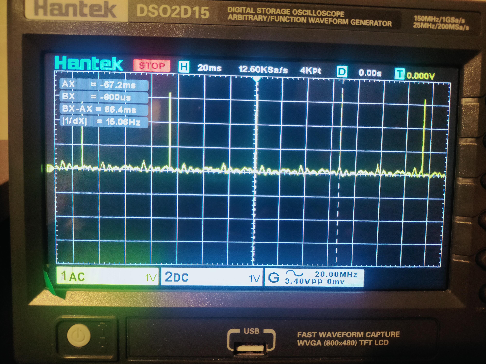

# Lattice FPGA ice40HX1K - Ov7670 camera - ILI9486 display

Cam main clock is 12Mhz supplied from FPGA pin. Cam pixel clock is 6Mhz. Divided the pclk/2. ov7670 auto adjusts the frame size when pclk is reduced. In default settings pclk = mclk.
In pclk/2 case frame is (640x480)/2. In single frame of 640x480 two images of 320x240 are side by side.

Lcd configs and displays data video frame. Lcd in 3.5 inch with active pixels array of 480x320. Ov7670 module only configs the Cam. Video data frames are picked by controller and 
passed to lcd for display.

Controller process is pclk sensitive. Lcd is clk sensitive. When lcd and ov7670 modules are done with their configurations. Video strobe or 'wr' signal control is taken over by controller
module and on each positive edge of pclk it grabes 8-bit cam pixel data and sends to lcd for display.

Lcd strobe requires 50-66ns according to ILI9486 data sheet. Our pclk clock is 6Mhz or 166.66ns. Enough to read pixel data from cam and display on lcd. Default pclk of 12Mhz does not work. 
Though 12Mhz translates to 83ns which is greater than lcd strobe requirement. Our FPGA is also working at same frequency. Increasing FPGA main clock to 24Mhz will make pclk of 12Mhz 
to work with ILI9486.      

Our frame rate theoratically now equals = (pclk - 1) / (frame sixe x pixel size) 
frame size = 480 x 640
pixel size = 2 bytes
pclk = 6Mhz
I am perfectly receiving 15 frames per second at 12Mhz cam master clock.

I noticed a blanking of 1 or 2 pixels at the sides of image. Dont know what it is for.
We can negate blanking from frame rate. Wish I could find ov7670 proper datasheet. 
